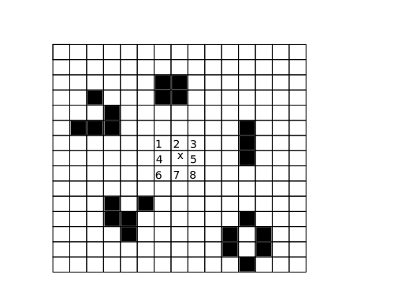

Problem: Simulating the Game of Life
--------------------------------------------------

In 1970, mathematician John H. Conway proposed a simulation that he
called the Game of Life.  Martin Gardner wrote an column about Life in
the October 1970 issue of :title-reference:`Scientific American` that
brought widespread attention to the Game of Life.  It's not what most people
think of as a game; there are no  players and there's no way to win
or lose the game.  Instead, Life is more like a model or simulation in
which you can play and experiment.

Life takes place on a two-dimensional grid of square cells.  Each
square cell can be either alive or dead (full or empty).

  
   Example of a Life board.  Cell **x**'s eight neighbours are numbered.

The simulation is carried out at fixed time steps; every time step,
all the cells on the grid can switch from dead to alive, or alive to
dead, depending on four simple rules that only depend on a given
cell's eight immediate neighbours.  Let's take the cell **x** in the
diagram, whose neighbours have been numbered 1 through 8 in the
diagram.

If the cell is dead:

1. **Birth**: if exactly three of its neighbours are
   alive, the cell will become alive at the next step.

If the cell is already alive:

1. **Survival**: if the cell has two or three live neighbours, the cell
   remains alive.

Otherwise, the cell will die:

2. **Death by loneliness**: if the cell has only zero or one live
   neighbours, the cell will become dead at the next step.
3. **Death by overcrowding**: if the cell alive and has more than three
   live neighbours, the cell also dies.

These rules are simple and readily understandable, but they lead to
surprisingly complex behaviour.  (The general term for a simulation
carried out on a grid of cells and following some simple rules is a
**cellular automaton**.)  For example, here are some patterns that
occur after starting with five live cells in a row.

.. XXX produce diagram of some changes; show that we end up in an oscillating
   state.

This pattern ends up in a cycle that repeats itself endlessly.
Researchers in Life have coined many terms for different types of
pattern, and this one is called an **oscillator**.  
`The wiki at ConwayLife.com <http://www.conwaylife.com/wiki/Main_Page>` 
describes many such terms.  For example, oscillators go through a
cycle of states and return to their initial state; **still life**
patterns are stable and don't change over time at all; **spaceships**
return to their initial configuration but in a different position, and
therefore the pattern moves through the grid.

Approach
========================================

It's possible to work out Life patterns using pencil and paper, but
obviously this is boring for large or long-lived patterns, and there's
also the risk of error.  Computer implementations of Life were written
soon after Conway described it.

A basic implementation is straightforward: store the state of the
board, and loop over every cell to determine its new state.  To be
correct, the code has to record new states in a copy of the board's
data structure and not update the original board as it's scanned.

Solution
========================================

This implementation of Life uses the :mod:`turtle` graphics to
draw the board.  Keystrokes are used to control the program; hit 'R' to
fill the board with a random pattern, and then 'S' to step through
one generation at a time.

.. literalinclude:: /code/life.py
   :linenos:

Code Discussion
========================================

The :class:`LifeBoard` class has a :attr:`state` attribute that's a
set of (X,Y) tuples that contain live cells.  The coordinate values
can vary between 0 and an upper limit specified by the :attr:`xsize`
and :attr:`ysize` attributes.

The :meth:`step` method computes a single Life generation.  It loops
over the entire board, and for each cell the code counts the number of
live cells surrounding it.  A new set is used to record the cells that
are live in the new generation, and after the whole board has been
scanned, the new set replaces the existing :attr:`state`.

The size of the :attr:`state` set is therefore proportional to the
number of live cells at any given time.  Another approach would be
just to have an N x N array representing the board, which would
require a fixed amount of memory.

If there are only a few live cells on a large board, most of the time
will be spent scanning empty areas of the board where we know nothing
is going to happen.  Cells never come alive spontaneously, without any
live neighbours.  Therefore, one minor optimization is to record the
minimum and maximum coordinates of live cells, and then limit the
scanning accordingly.  An entirely different approach called Hashlife
represents the board as a quadtree, a 2-dimensional tree structure,
and relies on large Life patterns often containing many copies of
similar structures.  (See the references for an explanation of
Hashlife.)

Lessons Learned
========================================

Part of what makes Life so fascinating is that it's easy to ask
questions and then try to answer them.  For example, if you start with
a straight line of N cells, which values of N produce interesting
patterns?  What if you make squares, or two lines of cells?  This
leads to asking more theoretical questions: are there Life patterns
that can make copies of themselves?  How fast can a spaceship move?
You can get an idea of the complexity hiding inside Life by exploring
some of the references for this section.

You may wonder if there's anything special about the rules that Conway
chose for Life.  For example, what if live cells survived when they
had four neighbours instead of dying?  You can easily experiment with
different rules by modifying the :file:`life.py` program.  Mirek
Wojtowicz has written a list of alternate rules at
http://www.mirekw.com/ca/rullex_life.html and comments on the
different properties of the resulting simulations.

People have also created many other cellular automata that change
other aspects such as:

* having the world be a 3-dimensional grid of cubes or a 1-dimensional
  line of cells instead of a 2-dimensional grid.
* use a triangular or hexagonal grid instead of a square one.
* have multiple colours for live cells; a newborn cell's can either be the majority colour
  of its neighbours, or
* have the cells containing decimal values between 0 and 1, instead of restricting
  values to only 0 and 1.

Fairly soon after Life was invented, Conway proved that there existed
Life patterns that were equivalent to a Turing Machine and therefore
could carry out any computable function.  In April 2000, Paul Rendell actually
constructed a Life pattern that behaved like a Turing machine.

References
========================================

Relevant web pages, books, with an annotation about why it's notable
or worthwhile.

http://www.math.com/students/wonders/life/life.html
  An introductory article by Paul Callahan.  The web page includes a Java applet
  that's similar to our Python application.

http://www.nytimes.com/1993/10/12/science/scientist-at-work-john-h-conway-at-home-in-the-elusive-world-of-mathematics.html
  A :title-reference:`New York Times` profile of mathematician John H. Conway,
  who invented Life.

http://www.ibiblio.org/lifepatterns/october1970.html
  A copy of Martin Gardner's 1970 :title-reference:`Scientific American` article
  that started it all.

http://home.interserv.com/~mniemiec/lifeterm.htm
  A glossary of Life terminology.

http://www.conwaylife.com/wiki/
  LifeWiki contains over a thousand Wiki articles about Life, including definitions
  of terms and descriptions of various patterns.

http://www.drdobbs.com/jvm/an-algorithm-for-compressing-space-and-t/184406478
  An April 2006 article by Tomas G. Rokicki that explains the HashLife
  algorithm and implements it in Java.
