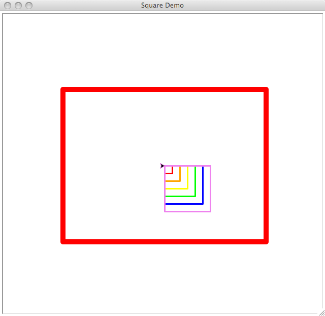

Background: Drawing Graphics
--------------------------------------------------

Throughout the rest of this book, we'll need to display graphical
output.  There are many different graphical toolkits available for
Python; the :ref:`turtle-references` section lists some of them.  
For this book I chose one of the simplest: the :mod:`turtle` module.

My reasons for selecting it are:

* :mod:`turtle` is included in the binary installers downloadable from 
  python.org.  No extra packages are required to use it.

* :mod:`turtle` can be used for drawing with Cartesian coordinates
  by calling the :meth:`setposition` method, but the turtle primitives
  are also useful for constructing interesting examples.  Most other toolkits
  only support Cartesian plotting.

Unfortunately the module doesn't support printed output,
but I think that isn't much of a disadvantage because interactive
graphics are more interesting for modern learners.  

.. XXX find a photo of a turtle robot

Turtle graphics are an approach with a long history.  Originally the
turtle was a physical object, a robot that could be placed on a large
sheet of paper and directed to move.  Then the turtle become a visual
abstraction on a high-resolution screen, often represented as a
triangle.  Even in a purely graphical format, the concept of the
turtle can make it easier to picture what actions are being carried
out, and hence what a program is doing.

Approach
========================================

The :mod:`turtle` module provides an environment where turtles move
upon a 2-dimensional grid.  Turtles have a position, a heading (the
direction in which the turtle is facing), and a variety of possible
states (turtles can draw lines in a particular colour when they move
or leave no trace) and actions (turning left or right; moving forward
or backward.

.. XXX add a diagram of the turtle
    
Here's a brief overview of the functions and methods used in this
book.  Consult :ref:`refcard-turtle` when you need some help
remembering a method, and the Python Library Reference's documentation
for the :mod:`turtle` module for a complete description of all the
module's features.

(The module often has synonyms for the same action; I've chosen
the one I think is the clearest.  For example, the methods
``backward(**dist**)``, ``back(**dist**)``, and ``bk(**dist**)``
all do the same thing, moving the turtle backwards.  I've chosen
to use ``back(**dist**)`` consistently.)

You create a turtle by calling ``turtle.Turtle()``.  Doing this will
automatically pop
up a separate window (called a :class:`Screen`) 
on your computer's display. You can call 
``turtle.Screen`` to get an object representing this window;
it has a few methods such as :meth:`title`
to set the title, :meth:`screensize` to get the size of the canvas, 
and :meth:`clear` to restore the screen's contents
to their initial state.

A :class:`Turtle` object has many methods that can be grouped into
families.  There are methods for  controlling the turtle's motion:

* ``forward(**distance**)`` moves the turtle forward **distance** pixels, in
  whatever direction the turtle is pointing.
* ``back(**distance**)`` moves backward **distance** pixels.
* ``left(**angle**)`` and ``right(**angle**)`` change the turtle's orientation
  without moving it.  By default angles are measured in degrees, but you
  can call the turtle's :meth:`radians` method to use radians in future 
  calls to :meth:`left` and :meth:`right`.
* The turtle's movements aren't normally performed instantly, but
  instead are slowed down and animated so that the eye can follow what
  the turtle is doing.  You can change the speed of the turtle's motion
  by calling ``speed(**value**)``, where **value** is a string giving
  a speed; "fastest" results in instananeous motion,
  and "fast", "normal", "slow", and "slowest" are progressively slower 
  speeds.
* The turtle is usually drawn as an arrowhead.  The :meth:`hideturtle` 
  method prevents the turtle from being displayed, and :meth:`showturtle`
  brings it back.

To read the turtle's position and heading:

* :meth:`pos` returns a tuple giving the **(x,y)** coordinate where
  the turtle is currently located.  :meth:`xcor` and :meth:`ycor`
  return just the X or Y coordinate.
* :meth:`heading` returns the turtle's heading, usually in degrees 
  (but if you've previously called :meth:`radians` the result will be
  measured in radians).

To move the turtle to a particular coordinate and orientation:

* ``setpos(**x**, **y**)`` moves the turtle to the given coordinate,
  drawing a line if the pen is down.  You can also provide a pair of 
  coordinates as a single argument.
* ``setheading(angle)`` sets the turtle's orientation to **angle**.
  Usually 0 degrees is east, 90 is north, 180 is west, and 270 is south.
* :meth:`home` returns the turtle to position (0,0) and resets its 
  orientation to east.

The turtle can draw a line behind it as it moves.  To control this line:

* :meth:`pendown` puts the pen down on the paper (metaphorically), so the
  turtle will leave a line as it moves.
* :meth:`penup` raises the pen from the paper, so the turtle will move
  without leaving any trace.
* ``pencolor(**color**)`` sets the color of the line traced.  **color**
  is a string giving a primary color name, such as "red" or "yellow", or an
  RGB color specification such as "#33cc8c".  (The database of color names is
  limited, so specific names such as  "crimson" or "octarine" won't work,
  but simple names such as "red", "blue", and "green" are understood.)
* ``pensize(**width**)`` sets the width of the line traced.  The
  width starts out as 1 pixel, but can be changed using this method.

The turtle can also stamp its image on the display:

* :meth:`stamp` records a copy of the turtle's shape onto the canvas.
  This method returns an integer stamp ID, so that you can remove the image
  later by calling :meth:`clearstamp` and passing it the ID.
* ``dot(**size**, **color**)`` draws a circular dot of the given size and
  color.  The color is optional; if not supplied, the turtle's current
  pen color is used.
* The turtle :meth:`reset` method clears all of the drawings made by that
  turtle and returns it to the home position.

Example
========================================

This program doesn't exercise every single method -- that would be
tediously long -- but it shows what turtle graphics are like by
drawing some simple graphics and then waiting for a keypress before
exiting.

.. literalinclude:: /code/turtledemo.py
   :linenos:

The display resulting from this program is:

Code Discussion
========================================

.. _turtle-references:

References
========================================

http://cairographics.org/
  Cairo is a 2D graphics library with a Python API that supports both
  screen and printed output.

"Turtle Geometry: The Computer as a Medium for Exploring Mathematics"
  By Harold Abelson and Andrea diSessa.
  A 1981 textbook that begins with polygons and ends with the
  curved spacetime of general relativity, using turtle graphics
  both to draw illustrative examples and as a conceptual model.
  ISBN 978-0-262-01063-4 (ISBN 978-0-262-51037-0 for the paperback).

  
